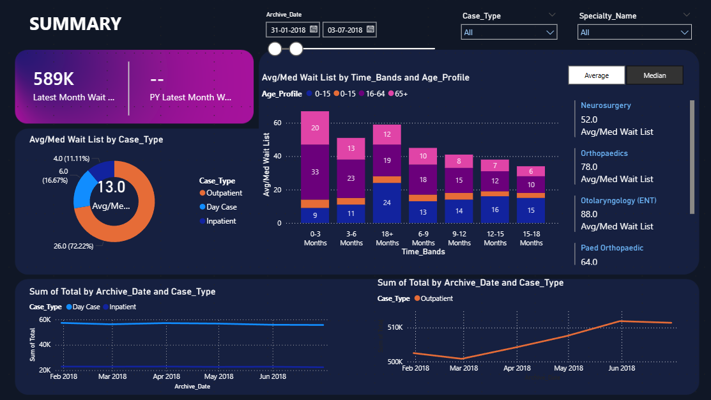
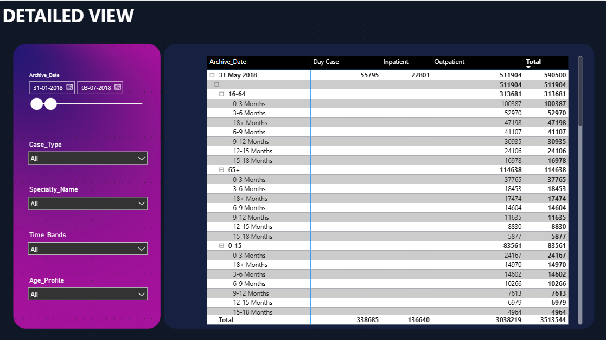

# 🏥 Hospital Waitlist Analysis Dashboard (Power BI)

## 📊 Project Overview

This project presents a comprehensive Power BI dashboard designed to analyze hospital patient waitlist data. The dashboard focuses on three major patient categories: **Inpatient**, **Outpatient**, and **Day Case**.

The main objective of this project is to understand patient distribution, waiting time patterns, and trends over time. It helps in identifying delays and supports better decision-making in healthcare management.

---

## 🎯 Objectives

* Analyze patient waitlist distribution across different case types
* Compare **Inpatient, Outpatient, and Day Case** categories
* Understand waiting time patterns using **time bands**
* Study patient distribution across **age groups**
* Track trends over time using historical data

---

## 🔍 Key Insights

* **Outpatients** represent the largest portion of the waitlist
* **Inpatients** are fewer but require more resources and attention
* Waiting time varies significantly across **different age groups**
* Longer waiting times are observed in higher time bands (e.g., 12–18 months)
* Patient volume trends show fluctuations over the years (2018–2021)

---

## 📌 Dashboard Structure

### 🔹 1. Summary Page

The summary page provides a high-level overview of the data using key performance indicators and visualizations.

**Key Elements:**

* Total waitlist count (Latest Month vs Previous Year comparison)
* Donut chart showing distribution by case type
* Bar chart showing average/median wait time by age group and time bands
* Line charts displaying trends over time
* Interactive filters (slicers) for:

  * Archive Date
  * Case Type
  * Specialty Name

---

### 🔹 2. Detailed View Page

The detailed page provides a deeper breakdown of the dataset in a tabular format.

**Key Elements:**

* Detailed table showing:

  * Inpatient count
  * Outpatient count
  * Day Case count
  * Total values
* Data grouped by:

  * Archive Date
  * Age Profile
  * Time Bands
* Interactive filters for deeper analysis:

  * Case Type
  * Age Profile
  * Time Bands
  * Specialty Name

---

## 📊 Data Description

The dataset includes the following attributes:

* **Case_Type** → Inpatient, Outpatient, Day Case
* **Age_Profile** → Age groups (0–15, 16–64, 65+)
* **Time_Bands** → Waiting time ranges (0–3 months, 3–6 months, etc.)
* **Archive_Date** → Historical time-based data
* **Specialty_Name** → Medical department

---

## 🛠 Tools & Technologies Used

* Power BI Desktop
* Data Visualization Techniques
* DAX (Data Analysis Expressions) for calculations
* Interactive dashboard design

---

## 🖼 Dashboard Preview

### Summary Page

### Detailed View

---

## 🚀 Business Use Case

This dashboard can be used by hospitals and healthcare organizations to:

* Monitor and manage patient waitlists
* Identify areas with long waiting times
* Optimize resource allocation
* Improve patient service efficiency
* Support data-driven decision-making

---

## 💡 Conclusion

This project demonstrates how data visualization can be used to transform raw healthcare data into meaningful insights. By analyzing patient waitlists across multiple dimensions, the dashboard helps stakeholders make informed decisions and improve overall healthcare performance.

---
